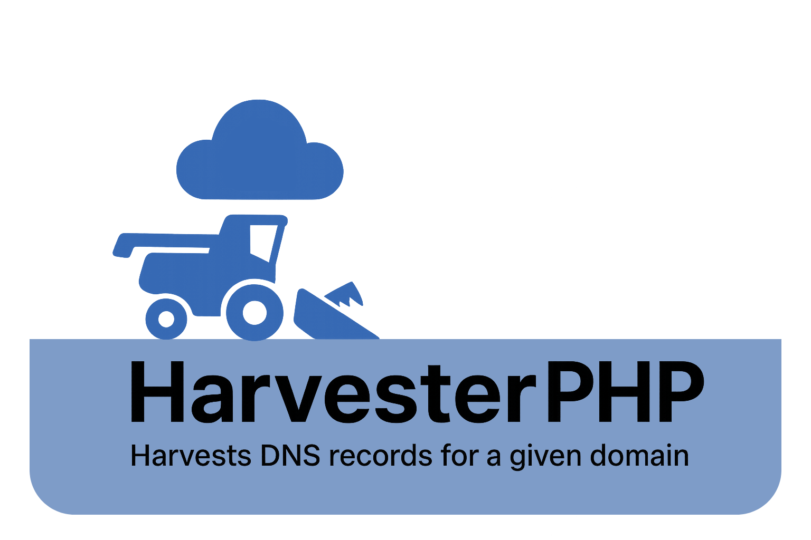

# DNS Harvester



This package allows you to gather DNS records from apex domains and predefined hostnames that can be manually defined.

- [**Installation**](#installation)
- [**Usage**](#usage)
    - [predefined records with pretty json](#predefined-record-with-pretty-json)
    - [with progress bar](#with-progress-bar)
    - [define own records to scan](#define-own-records-to-scan)
    - [print to bind format](#print-to-bind-format)

## Installation

Install HarvesterPHP in your app with Composer:
```
composer require danwats/harvesterphp
```

## Usage
### predefined records with pretty json
With predefined hostnames e.g. apex, www, etc. with pretty JSON
``` php 
use DNS\Harvester\RecordList;
use DNS\Harvester\DNS;

$recordList = new RecordList();
// Will run use predefined hostnames
$recordList->loadDefaults();

$dns = new DNS("google.com", $recordList);
$dns->harvest();
echo $dns->json(JSON_PRETTY_PRINT);
```

### with progress bar
If you want to show progress:
``` php
use DNS\Harvester\RecordList;
use DNS\Harvester\DNS;

$recordList = new RecordList();
$recordList->loadDefaults();

// Show Progress
$dns = new DNS("google.com", $recordList, true);
$dns->harvest();
echo $dns->json();
```

### define own records to scan
You don't have to use predefined hosts, you can add your own
``` php
use DNS\Harvester\RecordList;
use DNS\Harvester\RecordType;
use DNS\Harvester\Record;
use DNS\Harvester\DNS;

$recordList = new RecordList();
// add new hostname and what resource record to use, exclude loadDefaults()
$recordList->add(new Record('www', [RecordType::A, RecordType::AAAA, RecordType::CNAME, RecordType::TXT, RecordType::MX]));
$recordList->add(new Record('custom', [RecordType::A, RecordType::AAAA, RecordType::CNAME, RecordType::TXT, RecordType::MX]));

$dns = new DNS("google.com", $recordList, true);
$dns->harvest();
echo $dns->json();
```

### print to bind format
``` php
use DNS\Harvester\RecordList;
use DNS\Harvester\DNS;

$recordList = new RecordList();
$recordList->loadDefaults();

$dns = new DNS("google.com", $recordList);
$dns->harvest();
// with TTLs
echo $dns->bind();
// without TTLs
echo $dns->bind(false);
```
